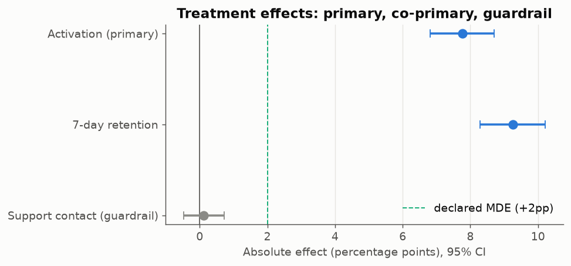
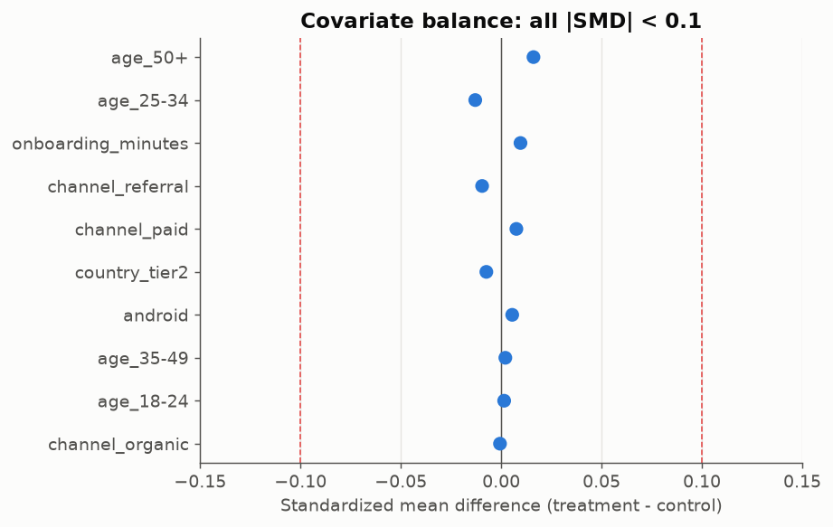
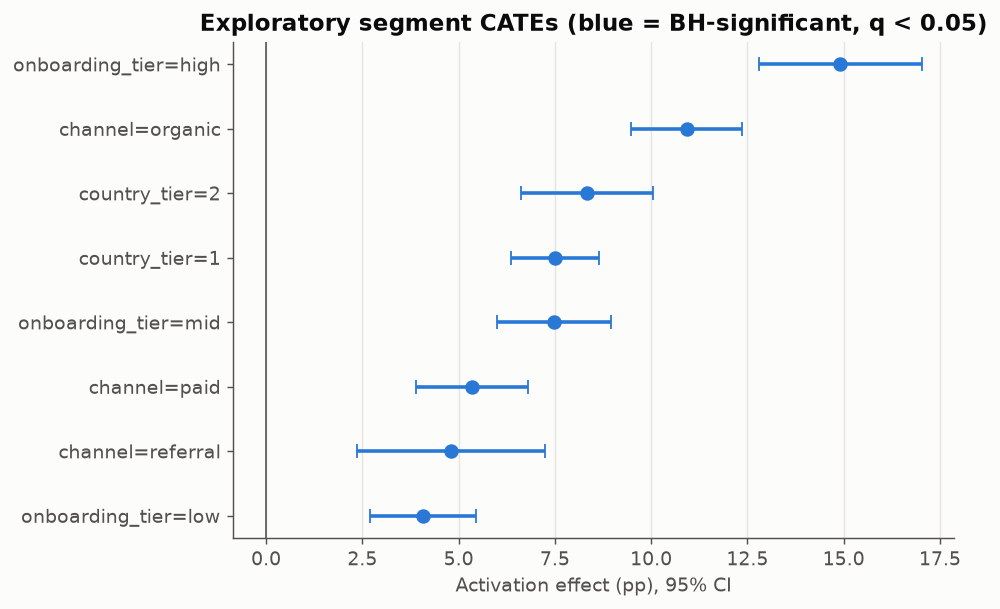
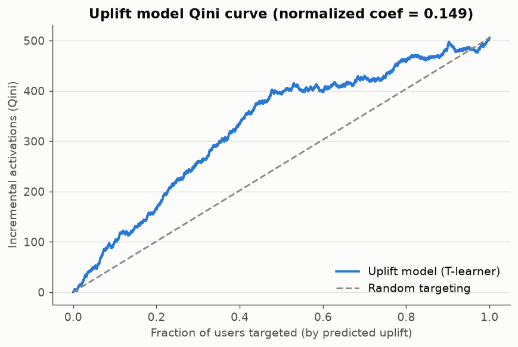
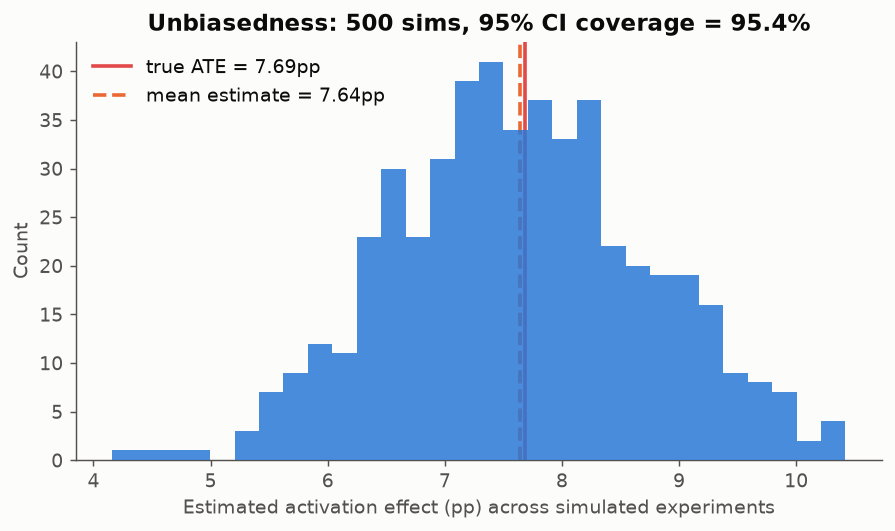
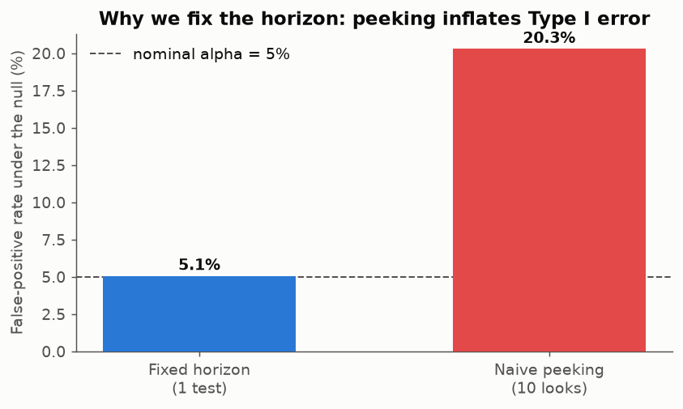

# Recurring Buy: experiment + causal inference → ship decision

An end-to-end **product experimentation and causal-inference** project for a
crypto/fintech context. A crypto product team ships **Recurring Buy** (auto-invest)
to new users and needs to know its causal effect on **7-day activation** (funded
account + first crypto trade) and **7-day retention**, then decide whether to ship.

The repo goes from raw event tables → a dbt/SQL modelling layer → a full
randomized-experiment analysis (integrity, ATE, CUPED, heterogeneity) → two
non-randomized causal cross-checks (IPW and difference-in-differences) → a
one-page **decision memo** with a SHIP recommendation. It runs offline with one
command and is fully reproducible.

**Read in this order:** [`EXPERIMENT_PLAN.md`](EXPERIMENT_PLAN.md) (what we
committed to *before* seeing outcomes) → [`DECISION_MEMO.md`](DECISION_MEMO.md)
(the recommendation) → this README (how it works).

> **Data disclosure — please read.** No proprietary or company data is used
> anywhere. Data is **synthetic**, generated by a seeded open script in this repo
> (`src/generate_data.py`). Because the data is synthetic, the **true treatment
> effect is known**, so every estimate is checked against ground truth — including
> a 500-run Monte-Carlo showing the estimator is unbiased with ~95% CI coverage.
> This is a methods showcase; the numbers are illustrative, the methods are real.

---

## Key results (actual numbers from a clean run)

The block below is **generated from `outputs/metrics.json` by `src/run.py`** — an
earlier hand-written version drifted out of sync with the code, so the numbers now
have exactly one source.

<!-- BEGIN:KEY_RESULTS (generated by src/run.py - do not edit by hand) -->
Sample: **40,000** new users randomized 50/50 —
19,910 control / 20,090 treatment.

| Metric | Control | Treatment | Effect (95% CI) | Verdict |
|---|---|---|---|---|
| **Activation** (primary) | 34.1% | 41.8% | **+7.76pp** [+6.82pp, +8.71pp], p = 1.4e-57 | significant, +22.8% relative |
| **7-day retention** (co-primary) | 37.0% | 46.2% | **+9.26pp** [+8.29pp, +10.22pp] | significant |
| Support-contact rate (guardrail) | 10.2% | 10.3% | +0.12pp [-0.47pp, +0.72pp], p = 0.69 | no harm |
| Net 7-day deposits (guardrail) | $68.55 | $71.98 | +$3.44 [+$2.38, +$4.49] | neutral-to-positive |

- **Experiment integrity:** SRM chi-square p = 0.37 (no sample-ratio
  mismatch); max |standardized mean difference| across 10 covariates =
  0.016 (well under 0.1).
- **Multiplicity:** two co-primary metrics, so each is tested at a Bonferroni
  alpha = 0.025; both clear it. Guardrails stay at the full alpha
  deliberately — correcting them would make harm harder to detect.
- **Power / MDE:** powered to detect **1.33pp** at 80% power; the
  pre-registered MDE was **2pp**, and the CI lower bound (+6.82pp)
  clears it — statistically *and* practically significant.
- **CUPED:** the pre-signup onboarding covariate (corr 0.29) cut the estimate's
  **variance by 8.2%**, which narrows the **CI by 4.2%**
  (0.95pp → 0.91pp half-width), point estimate unchanged. Those are
  two different numbers; the CI one is what a decision actually turns on.
- **Heterogeneous effects:** the top half of users by predicted uplift show
  **+11.17pp** activation lift vs **+3.21pp** for the bottom half (~3.5x),
  out-of-sample. Of 8 exploratory segments, **8 survive a
  Benjamini-Hochberg FDR correction**; lift concentrates in high-onboarding and
  organic-channel users.
- **Observational (IPW):** the naive adopter-vs-non-adopter retention gap
  (+22.81pp) is inflated by self-selection; inverse-propensity weighting gives
  **+13.19pp** [+11.48pp, +14.95pp], corroborated by regression
  adjustment (+13.77pp). True value +13.08pp.
- **DiD (phased regional rollout):** +2.25pp [+1.28pp, +3.23pp] on regional
  activation; parallel-trends pre-test p = 0.97; true effect +3.00pp, inside the CI.
  Inference is reported three ways because 12 clusters is too few to trust the
  default: classical SE 0.493pp, region-clustered 0.396pp (*smaller* — a
  small-cluster warning sign, rank 11 for 28 parameters), and a **wild cluster
  bootstrap p = 0.001**. The quoted CI is the wider classical one, since the
  tighter clustered interval is the one that cannot be justified here.
- **Ground-truth recovery:** the A/B estimate (+7.76pp) contains the true ATE
  (+7.69pp); a 500-run simulation gives mean estimate +7.64pp vs
  true +7.69pp with **95.4% CI coverage**.
- **Peeking:** naively testing at 10 interim looks inflates the false-positive rate
  from 5% to **~20%** — which is why the analysis is fixed-horizon.
<!-- END:KEY_RESULTS -->

**Decision: SHIP** to all new users, with onboarding placement prioritized for
high-engagement and organic cohorts. Full reasoning in
[`DECISION_MEMO.md`](DECISION_MEMO.md).

---

## Figures

**The decision, in one chart** — every effect against the bar we set in advance:



**Was the experiment healthy?** Check this *before* trusting any effect:



**Who should we target?** The uplift model sorts users out-of-sample, and the
segment view marks which subgroups survive multiplicity correction:




**Can we trust the estimator at all?** Because the data is synthetic, the true
effect is known — so this is a coverage check, not an assertion:



**Why the horizon is fixed** — the cost of peeking, simulated under the null:



Also in `outputs/figures/`: `fig_cuped.png` (variance reduction, CI before vs
after), `fig_observational_ipw.png` (propensity overlap; naive vs IPW vs
regression-adjusted) and `fig_did.png` (parallel pre-trends + event study). All
regenerated on every run.

---

## How to run (one command)

```bash
pip install -r requirements.txt
python3 src/run.py
```

That single entry point is deterministic (fixed seeds) and:

1. generates the seeded synthetic data → `seeds/*.csv`
2. builds the DuckDB warehouse via **dbt** (raw → staging → marts, with dbt tests);
   if dbt is not installed it automatically falls back to the equivalent plain SQL
   in `sql/build.sql` and produces identical marts
3. runs the full analysis
4. writes `outputs/metrics.json`, `outputs/figures/*.png`, `outputs/exec_summary.md`,
   `DECISION_MEMO.md`, and the generated results block in this README

```bash
python3 tests/test_experiment_stats.py   # stats helpers, multiplicity, AI guardrail
python3 tests/test_warehouse_parity.py   # dbt vs plain-SQL parity, mart invariants
python3 tests/test_reports_in_sync.py    # README + memo match metrics.json
python3 -m pytest tests -q               # or all three at once
```

No network access, no external warehouse, no credentials. The only optional
network call is the AI summary layer below, which is off unless you ask for it.

**How reproducible, precisely.** The seeded data generation is stable across
library versions — `numpy.random.Generator` guarantees its stream, so the
synthetic dataset and every closed-form statistic (effects, CIs, p-values, SRM,
CUPED, IPW, DiD) reproduce to display precision on NumPy 2.0 through 2.5. The one
number that moves is the uplift model's Qini coefficient, which shifts in the
third decimal (0.1484 → 0.1486) with the scikit-learn version, because
gradient-boosting internals change between releases. Everything else differs only
in floating-point summation noise (~1e-15 relative). Committed outputs come from
the versions a fresh `pip install -r requirements.txt` resolves today.

---

## Data-modelling layer (dbt + DuckDB)

A real dbt project (`dbt_project.yml`, `models/`) runs on DuckDB via `dbt-duckdb`:

```
seeds (raw_*)  →  models/staging/stg_*.sql  →  models/marts/mart_*.sql
```

- **raw**: `raw_users`, `raw_activation`, `raw_did_panel` (loaded as dbt seeds)
- **staging**: typed, cleaned views; deliberately outcome-free for the user tables
  so covariates stay pre-treatment by construction
- **marts**:
  - `mart_experiment_users` — the flagship one-row-per-user analysis table
    (assignment, pre-period covariate, exposure, primary + guardrail metrics)
  - `mart_did_panel` — region × week panel ready for difference-in-differences
- dbt data tests enforce uniqueness, not-null, and accepted values (23 tests pass).

`sql/build.sql` mirrors the same raw → staging → marts DAG in plain SQL so the
project still runs end-to-end if dbt is unavailable. That mirroring is itself
tested — `tests/test_warehouse_parity.py` builds both ways and asserts the marts
are identical, because "produces identical marts" is a claim a reader shouldn't
have to take on faith.

---

## Using AI in the workflow (and where it is not allowed near the numbers)

`src/ai_summary.py` drafts the plain-language stakeholder summary
(`outputs/exec_summary.md`). The division of labour is the point:

> the model writes the **language**; the pipeline owns the **numbers**.

Every numeric token in the draft is extracted and checked against the fact sheet
the model was given. A number that cannot be traced back — a plausible-sounding
"$2.4M annual revenue", a rounded-wrong effect size — **rejects the entire draft**
and the deterministic template ships instead. The audit trail lands in
`outputs/ai_summary_audit.json`.

Three deliberate choices:

- **The check is mechanical, not another model call.** An LLM verifying an LLM
  shares the failure mode.
- **The whitelist is the fact sheet, not all of `metrics.json`.** Scoped to ~38
  admissible values instead of ~380, an invented figure is far less likely to
  collide with an unrelated metric once rounded. This was found the hard way: with
  the wider set, a fabricated `$2.4M` slipped through by coinciding with a deposits
  confidence bound of 2.38.
- **Rounding is allowed, invention is not.** A draft number is accepted if an
  admissible value agrees with it at the precision it is quoted to — so `7.8pp`
  passes against a true `7.76pp`, while `8.4pp` does not.

Off by default; the pipeline is fully offline without it. To enable:

```bash
ANTHROPIC_API_KEY=... USE_LLM=1 python3 src/run.py
```

## Methods

Pre-registered in [`EXPERIMENT_PLAN.md`](EXPERIMENT_PLAN.md) before looking at
outcomes: primary = activation, co-primary = retention, guardrails = support
contact + deposits, α = 0.05 two-sided (0.025 per co-primary), power = 0.80,
MDE = 2pp, decision rule = ship if activation is significant, its CI lower bound
clears the MDE, and no guardrail is harmed.

- **Experiment integrity** — group sizes, SRM chi-square, covariate balance (SMD).
- **ATE** — two-proportion z-test with a Wald CI (unpooled SE for the interval,
  pooled SE for the test), a bootstrap CI as a robustness check, and a power/MDE
  calculation; practical significance judged against the declared MDE.
- **Multiplicity** — Bonferroni across the two co-primary metrics;
  Benjamini-Hochberg FDR across the exploratory segment CATEs. Guardrails are
  left **uncorrected** on purpose: correcting a metric you are trying not to move
  only makes harm harder to detect.
- **CUPED** — variance reduction using the pre-signup onboarding covariate; θ
  estimated on pooled data so the adjusted estimator stays unbiased. Variance
  reduction and CI-width reduction are reported **separately**, because the CI
  improves by only about half the variance figure and conflating the two
  overstates precision.
- **Heterogeneous effects** — segment-level CATEs with CIs and BH-adjusted
  q-values, plus a **T-learner** uplift model evaluated out-of-sample (Qini curve
  normalized to be comparable across sample sizes, top-vs-bottom-half validation).
- **Observational causal inference** — effect of *adopting* Recurring Buy (self-
  selected, non-randomized) on retention via **inverse-propensity weighting**, with
  an overlap/positivity check and a regression-adjustment cross-check. Identifying
  assumptions (conditional ignorability, positivity, SUTVA) are stated explicitly.
- **Difference-in-differences** — TWFE with region and week fixed effects on a
  phased regional rollout, plus a parallel-trends pre-test and an event study.
  Inference is the interesting part: with only **12 clusters**, clustering by
  region makes the SE *smaller* than the classical one — the opposite of the usual
  Bertrand–Duflo–Mullainathan result, and a symptom of too few clusters rather
  than a precision gain. So all three are reported (classical, cluster-robust, and
  a **wild cluster bootstrap** with Rademacher weights), the wider classical CI is
  the one quoted, and the bootstrap p-value is what the conclusion rests on. The
  event study uses HC1 rather than clustered SEs because clustering a
  43-parameter spec on 12 clusters yields a rank-10 covariance with negative
  variances — undefined, not conservative.
- **Sequential testing** — a simulation quantifying the Type-I-error cost of
  peeking, motivating the fixed-horizon design (alpha-spending / always-valid CIs
  noted as the remedy for live monitoring).
- **Correctness checks** — a 500-run Monte Carlo for unbiasedness and CI coverage,
  every estimate compared against the known synthetic truth, and a test suite
  covering the statistical helpers, the warehouse invariants, dbt/plain-SQL
  parity, and report-vs-metrics consistency.

## Repo structure

```
crypto_experiment_analysis/
├── EXPERIMENT_PLAN.md        # pre-registration: metrics, MDE, decision rule, threats
├── DECISION_MEMO.md          # flagship output (generated) — SHIP recommendation
├── README.md                 # this file (results block generated)
├── LICENSE                   # MIT
├── requirements.txt
├── dbt_project.yml           # dbt project (DuckDB)
├── profiles.yml              # local, offline dbt profile
├── .github/workflows/ci.yml  # runs tests + the full pipeline on every push
├── models/
│   ├── staging/              # stg_*.sql + source/test schema
│   └── marts/                # mart_experiment_users.sql, mart_did_panel.sql
├── sql/build.sql             # plain-SQL fallback mirroring the dbt DAG
├── seeds/                    # generated raw CSVs (deterministic)
├── src/
│   ├── generate_data.py      # seeded synthetic generator (known ground truth)
│   ├── build_warehouse.py    # dbt-or-fallback warehouse build
│   ├── experiment_stats.py   # pure, tested statistical helpers
│   ├── analysis.py           # all analysis blocks + figures
│   ├── ai_summary.py         # LLM stakeholder summary + numeric guardrail
│   ├── viz.py                # shared plotting style (CVD-safe palette)
│   └── run.py                # single entry point
├── tests/
│   ├── test_experiment_stats.py   # helpers, multiplicity, AI guardrail, ground truth
│   ├── test_warehouse_parity.py   # dbt vs plain-SQL parity + mart invariants
│   └── test_reports_in_sync.py    # README/memo must match metrics.json
└── outputs/
    ├── metrics.json          # every number, machine-readable
    ├── ground_truth.json     # the known synthetic effects
    ├── exec_summary.md       # plain-language summary (AI-drafted or template)
    ├── ai_summary_audit.json # what the numeric guardrail checked and decided
    └── figures/*.png
```

## How this maps to the product job

This mirrors the day-to-day of a product data scientist on a crypto team: model
event data into a clean analysis table, check experiment health before trusting a
result, estimate a causal effect with honest uncertainty, tighten it with CUPED,
find who to target with an uplift model, back out the effect of organic feature
adoption when you *can't* randomize, cross-check with a rollout DiD, and turn all
of it into a crisp ship/hold recommendation with guardrails and a confidence level.

| What the role needs | Where it is in this repo |
|---|---|
| SQL + modern data modelling | dbt project on DuckDB (`models/`), staging → marts, 23 dbt data tests |
| Experimentation | SRM, covariate balance, power/MDE, CUPED, multiplicity control, peeking simulation |
| Causal inference | IPW with overlap + regression cross-check, DiD with parallel-trends test and few-cluster inference |
| Metrics + analytical frameworks | pre-registered metric hierarchy (primary / co-primary / guardrail) in `EXPERIMENT_PLAN.md`, `mart_experiment_users` as the single analysis table |
| Influencing decisions | `DECISION_MEMO.md` with an explicit decision rule, `outputs/exec_summary.md` for a non-technical audience |
| Product thinking | the memo argues about onboarding real estate and habit formation, not p-values; the MDE is set as a product judgment |
| Using AI tools | `src/ai_summary.py` — LLM for language, mechanical guardrail for numbers |
| Crypto/fintech context | activation = funded + first crypto trade; recurring buy as a habit feature; deposits as a cannibalisation guardrail |

## Limitations (honest)

- Data is synthetic; effect sizes are illustrative, not benchmarks for a real
  feature. The value is the method and its correctness, verified against known truth.
- Outcomes are 7-day; a habit feature like recurring buy likely compounds, so the
  memo flags 30/90-day monitoring rather than over-crediting the short window.
- The IPW estimate rests on unconfoundedness (no unmeasured confounders); it is
  treated as supporting evidence, and an encouragement/IV design is the honest next
  step in production.
- The DiD uses a **common** rollout time across treated regions to keep the TWFE
  estimator clean; genuinely staggered adoption would call for
  Callaway–Sant'Anna / Sun–Abraham estimators to avoid negative-weight bias.
- The DiD has only **12 clusters**. A wild cluster bootstrap is reported for that
  reason, but 12 units is few for any cluster-robust method, and the DiD estimand
  (a regional average including users who never enrolled) is *not* the same
  quantity as the user-level A/B effect — it corroborates, it does not replicate.
- Novelty cannot be ruled out by any analysis inside a 7-day experiment. That is a
  post-launch monitoring commitment, not a claim this repo can make.
